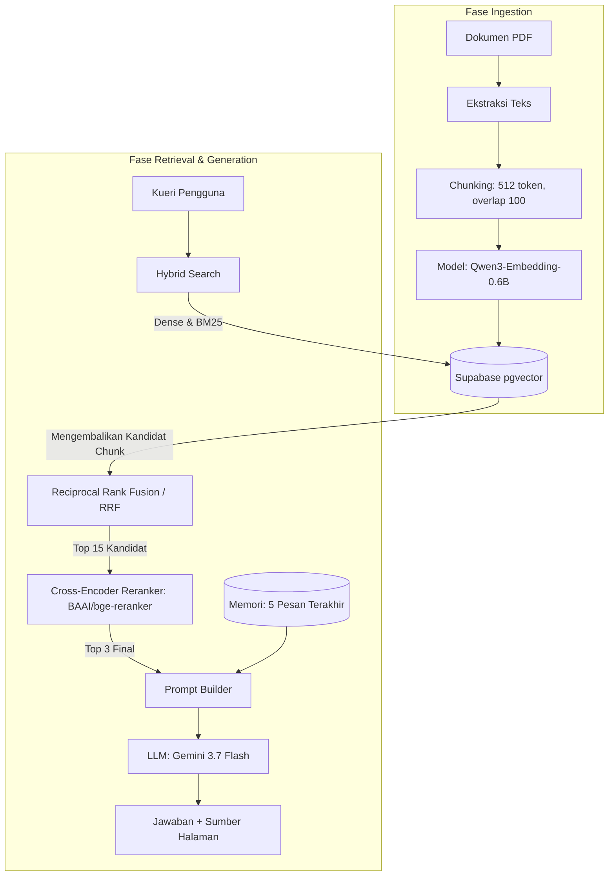

# Chatbot RAG - Accurate Online Modul Pembelajaran

Prototipe Chatbot RAG (Retrieval-Augmented Generation) yang dirancang untuk menjawab pertanyaan pengguna berdasarkan dokumen Modul Pembelajaran Accurate Online. Sistem ini dibangun dengan fokus pada kejujuran, akurasi *retrieval* tinggi melalui arsitektur *Hybrid Search*, dan pemeliharaan konteks percakapan.

## Cara Menjalankan dari Nol

### Prasyarat

- Python 3.11
- Node.js 22
- Akun [Supabase](https://supabase.com)
- API key [Gemini](https://aistudio.google.com/apikey)

### 1. Setup Supabase

1. Buat project baru di Supabase
2. Buka **Database → Extensions**, aktifkan extension `vector`
3. Buka **Database → Connection string**, pilih mode **Session pooler**, salin URI-nya

### 2. Environment Variables

**`backend/.env`** (copy dari `backend/.env.example`):

| Variable         | Keterangan                                                                                 |
| ---------------- | ------------------------------------------------------------------------------------------ |
| `GEMINI_API_KEY` | API key dari Google AI Studio                                                              |
| `DATABASE_URL`   | Connection string Supabase, format `postgresql://postgres:[password]@[host]:5432/postgres` |

**`frontend/.env.local`**:

| Variable              | Keterangan                                           |
| --------------------- | ---------------------------------------------------- |
| `NEXT_PUBLIC_API_URL` | URL backend FastAPI, default `http://localhost:8000` |

### 3. Backend

```powershell
cd backend
python -m venv venv
.\venv\Scripts\Activate.ps1
pip install torch --index-url https://download.pytorch.org/whl/cpu
pip install -r requirements.txt

python -c "from app.core.db import init_db; init_db(); print('OK')"  # buat tabel + extension pgvector

uvicorn app.main:app --reload
```

### 4. Frontend

```powershell
cd frontend
npm install
npx shadcn@latest init      # kalau belum pernah dijalankan
npx shadcn@latest add sidebar button separator tooltip
npm run dev
```

## Arsitektur Sistem

Berikut adalah alur arsitektur dari dokumen mentah hingga menghasilkan jawaban ke pengguna:



## Keputusan Teknis & Trade-off

### Embedding Model — Qwen3-Embedding-0.6B

**Keputusan:** Qwen3-Embedding-0.6B, self-hosted via `sentence-transformers`.

**Alasan:**

- Multilingual (100+ bahasa) — dokumen target campur Bahasa Indonesia & Inggris
- Single dense vector, Apache 2.0, dimensi fleksibel (Matryoshka Representation Learning)
- Sistem didesain berjalan **self-hosted, CPU-only** sejak awal (tanpa dependency GPU) — pemilihan model mempertimbangkan compute/latency budget yang realistis untuk profil komputasi ini.

**Trade-off & Keterbatasan:** Rencana awal mencakup uji coba komparatif dengan model yang lebih superior seperti Alibaba-NLP/gte-Qwen2-1.5B-instruct. Namun, niat ini tidak dilanjutkan karena terjadi error pada tahap instalasi akibat keterbatasan spesifikasi CPU lokal yang tidak mendukung eksekusi arsitektur model tersebut. Hal ini menghambat kesempatan untuk membandingkan secara empiris peningkatan kualitas pencarian antara Qwen3-0.6B dengan model embedding berukuran 1B+ parameter di lingkungan hardware saat ini.

### LLM — Gemini API

**Keputusan:** Gemini API (`gemini-3.7-flash`, via `google-genai` SDK).

**Alasan:** Memanfaatkan kecerdasan deduksi Gemini 3.7 Flash untuk memetakan pertanyaan lanjutan ke dokumen yang relevan, mampu memahami referensi kata ganti (seperti "yang pertama tadi") dari memori riwayat, serta menjaganya tetap sederhana tanpa membebani latensi sistem dengan komputasi Query Rewriting tambahan. Kepatuhannya terhadap instruksi system prompt untuk menolak halusinasi juga sangat kuat.

### Chunking Strategy — `chunk_size=512`

**Keputusan:** `chunk_size=512` token, `chunk_overlap=100` token, dengan **seluruh halaman digabung dulu sebelum di-chunk** untuk menghindari celah informasi di tiap batas halaman.

**Alasan (hasil eksperimen empiris, top-k × chunk_size):**

| Ukuran chunk               | Keunggulan                                                                                                 | Kelemahan                                                                                                                                                                                                |
| -------------------------- | ---------------------------------------------------------------------------------------------------------- | -------------------------------------------------------------------------------------------------------------------------------------------------------------------------------------------------------- |
| **Besar (512)** ✅ dipilih | Mampu menangkap informasi yang butuh banyak sumber referensi sekaligus, dibanding chunk kecil (128-384)    | Penggunaan token lebih banyak (butuh `top_k` lebih besar); rentan fenomena _"lost in the middle"_; berisiko halusinasi kalau konteks terlalu panjang; kurang tajam untuk pertanyaan yang sangat spesifik |
| Kecil (128-384)            | Bagus untuk pertanyaan spesifik & jawaban singkat; informasi yang di-retrieve lebih padat, LLM lebih fokus | Tidak bisa menangkap informasi besar/kompleks dalam 1 chunk; hasil retrieval rentan terpotong, kehilangan konteks utuh                                                                                   |

Chunk besar (512) dipilih karena dokumen target sering butuh sintesis dari beberapa kalimat/paragraf sekaligus untuk menjawab dengan benar — trade-off token/biaya lebih besar diterima demi kelengkapan jawaban.

### Strategi Retrieval — Hybrid Search & Reranking (`FINAL_TOP_K=3`)

**Keputusan:** Menggunakan pencarian silang (*Hybrid Search*) yang menggabungkan pencarian semantik (Vektor) dan pencarian presisi kata kunci (BM25) melalui metode *Reciprocal Rank Fusion* (RRF). Kandidat kasar yang dihasilkan kemudian disaring menggunakan *Cross-Encoder Reranker* (`BAAI/bge-reranker-v2-m3`) untuk mendapatkan 3 *chunk* final.

**Alasan & Bukti Empiris:**
Keputusan untuk mengkombinasikan arsitektur Hibrida beserta penetapan nilai `FINAL_TOP_K=3` didasarkan pada hasil eksperimen komparasi berikut:

| Mode | Top-K | Precision | Recall | Est. Token/Query |
| :--- | :--- | :--- | :--- | :--- |
| Vector | 3 | 0.167 | 0.500 | ~1544 token |
| **Hybrid+Rerank** | **3** | **0.333** | **1.000** | **~1582 token** |
| Vector | 5 | 0.120 | 0.600 | ~2296 token |
| Hybrid+Rerank | 5 | 0.200 | 1.000 | ~2240 token |
| Vector | 8 | 0.125 | 1.000 | ~3480 token |
| Hybrid+Rerank | 8 | 0.125 | 1.000 | ~3431 token |
| Vector | 10 | 0.100 | 1.000 | ~4225 token |
| Hybrid+Rerank | 10 | 0.100 | 1.000 | ~4173 token |

Berdasarkan data eksperimen di atas, pengambilan keputusan ditekankan pada tiga metrik utama:

1. **Optimalisasi Recall (Penemuan Fakta):** Metode *Hybrid+Rerank* menunjukkan keunggulan absolut dengan mencapai tingkat *Recall* 1.000 (berhasil menemukan 100% referensi jawaban) hanya dengan menarik 3 *chunk* teratas. Sebagai perbandingan, metode Vektor standar sangat tertinggal dan baru bisa menyentuh angka *Recall* 1.000 jika dipaksa menarik 8 *chunk* sekaligus (`Top-K = 8`).
2. **Minimalisasi Noise (Precision):** Menaikkan nilai K di atas 3 pada mode Hibrida tidak memberikan tambahan manfaat penemuan jawaban, melainkan hanya menurunkan *Precision* secara drastis (memasukkan terlalu banyak teks yang tidak relevan). Pada K=3, metode ini mempertahankan presisi tertinggi (0.333), memastikan LLM tetap fokus pada informasi inti.
3. **Efisiensi Beban Token:** Dengan mencapai akurasi maksimal di K=3, arsitektur Hibrida ini hanya mengonsumsi estimasi ~1582 token input per kueri. Jika mengandalkan Vektor standar yang membutuhkan K=8 untuk mencapai akurasi setara, sistem harus menelan beban ~3480 token per kueri. Implementasi Hibrida menghemat sekitar ~1900 token per giliran obrolan, yang secara langsung menekan potensi *rate-limiting* API dan mencegah terjadinya fenomena *"lost in the middle"*.

### Conversational Memory

**Keputusan:** **Generation-only memory** — 5 pesan riwayat percakapan terbaru disisipkan ke prompt LLM, TAPI **tidak mempengaruhi retrieval**. Retrieval tetap murni mencari berdasarkan teks pertanyaan saat ini.

**Alasan:** Titik awal paling sederhana untuk mengukur seberapa jauh model bisa menangani pertanyaan lanjutan (misal kata ganti "itu"/"nya") tanpa perlu query rewriting. Sumber data riwayat: tabel `Message` di Supabase (bukan state di sisi Gemini) — konsisten dengan riwayat chat yang sama persis dilihat user di UI.

**Trade-off / known limitation:** Kalau pertanyaan lanjutan butuh **retrieval baru** yang berbeda dari pertanyaan sebelumnya (beda topik pembahasan), retrieval bisa gagal menemukan chunk yang tepat karena kata kunci di pertanyaan saat ini saja tidak cukup eksplisit.

## Keterbatasan Sistem
1. Trade-off Kualitas LLM vs Rate Limit (Gemini 3.7 Flash): Kendala terbesar dalam pengembangan ini adalah batasan rate limit (kuota request) yang sangat ketat pada Gemini 3.7 Flash. Meskipun model ini menghasilkan jawaban dan nalar yang jauh lebih berkualitas dari versi Flash-Lite, proses pengujian skalabilitas metrik (faithfulness, answer relevancy, dan context relevancy) sering kali menjadi bottleneck yang memakan waktu eksekusi yang lama.
2. Limitasi Ekstraksi Visual & Spesifikasi Hardware Lokal: Karena sistem dikembangkan pada mesin lokal dengan batasan memori (VRAM), saya tidak dapat menggunakan metode ekstraksi PDF berbasis Vision-Language Model (VLM) atau model parsing berat. Akibatnya, sistem saat ini masih memiliki "kebutaan" terhadap informasi instruksional yang murni tertanam di dalam gambar PDF.
3. Trade-off Latensi Reranking CPU: Untuk menjamin kualitas retrieval, model Cross-Encoder 567M parameter berjalan murni di atas CPU lokal. Trade-off dari keputusan komputasi ini adalah penambahan latensi sekitar 1 hingga 3 detik sebelum LLM mulai merangkai kalimat.
4. Memori Percakapan Tanpa Query Rewriting: Retrieval murni bergantung pada kata kunci di pertanyaan saat ini. Jika pengguna bertanya dengan kata ganti ekstrem yang sama sekali tidak memiliki kaitan leksikal, proses retrieval berisiko menarik chunk yang salah.

## Rencana Perbaikan
1. Penerapan Query Rewriting Lintas Giliran: Menambahkan LLM super ringan (Llama-3-8B atau Gemini seri Flash-Lite) di awal pipeline yang khusus bertugas menulis ulang pertanyaan pengguna agar resolusi memori pencarian mencapai akurasi absolut.
2. Integrasi OCR & Vision Parser: Menerapkan sistem cloud-based parsing (seperti LlamaParse) untuk mendeskripsikan secara otomatis ratusan gambar tangkapan layar di modul Accurate Online ke dalam format Markdown.
3. Optimasi Hyperparameter: Mengembangkan matriks pengujian yang komprehensif terkait jumlah token, top-k, dan pengaturan bobot RRF, kemudian mencatatnya menggunakan tools observability (LangSmith atau MLflow) secara mendetail.

## System Prompt

```
Kamu adalah asisten yang menjawab HANYA berdasarkan konteks dokumen yang diberikan (termasuk penanda halaman). Baca konteks dengan saksama, termasuk detail kecil dan catatan kaki -- jangan lewatkan. Kalau jawaban tidak ada di konteks, katakan jujur bahwa informasi tidak tersedia -- jangan mengarang. Sertakan referensi halaman kalau tersedia

Ikuti instruksi gaya penulisan dari pengguna kalau ada (itu bukan pertanyaan faktual yang perlu dicari di teks). Kalau pengguna tampak bingung atau minta arahan awal tanpa pertanyaan spesifik, boleh rangkum langkah/pengenalan dasar dari dokumen. Kalau pengguna memberi skenario/kasus spesifik dan minta saran, boleh berikan rekomendasi dengan mencocokkan situasinya ke aturan/definisi/contoh di dokumen -- ini bukan halusinasi selama dasarnya ada di konteks.

Jawab langsung ke inti, tanpa awalan seperti 'berdasarkan konteks yang diberikan'. Tulis plain text (tanpa markdown bold/heading/tanda bintang), TAPI kalau jawabannya berupa jenis/kategori/daftar/langkah, WAJIB pakai penomoran (1., 2., dst) -- jangan digabung jadi satu paragraf naratif.

Gunakan riwayat percakapan untuk memahami pertanyaan lanjutan (kata ganti seperti 'itu', 'yang kedua', dst), dan boleh gabungkan info riwayat + konteks untuk menjawab. Kalau topik pertanyaan baru sama sekali tidak berdasar di riwayat maupun konteks saat ini, jujur katakan tidak ditemukan -- jangan mengarang.
```

Sumber: `backend/app/generation/prompt.py`.
